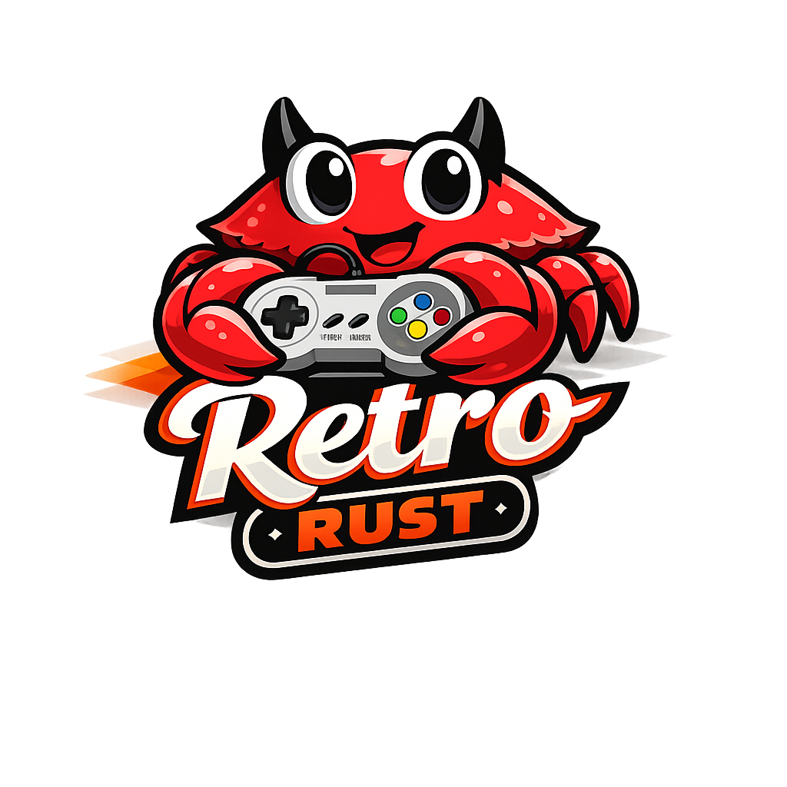
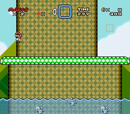
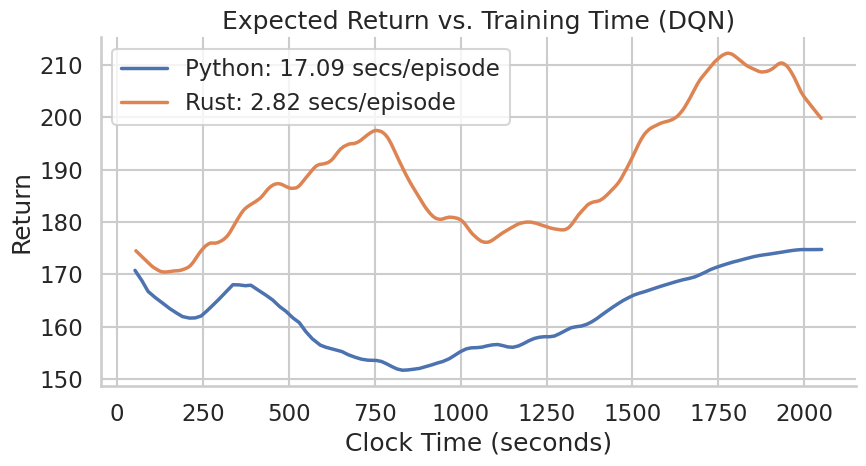

  

  A rust-based <a href="https://github.com/openai/retro">Gym Retro</a> API

# Retro Rust

- Retro game emulator environments designed for reinforcement learning experiments.
- Support for classic games like *Super Mario World* and *Donkey Kong*:

  

- <ul style="list-style: none; padding-left: 0;">
      <li>Designed for native Rust ML workflows:</li>
      <ul style="list-style: none; padding-left: 1em;">
        <li>➜ Ultra-fast training loops</li>
        <li>➜ Zero Python/C++ bindings</li>
      </ul>
  </ul>

## Getting started

A simple starting point may look like this:

    use retro_rust::environments::image_retro_env::ImageRetroEnv;
    use retro_rust::environments::image_retro_env::platform::Platform;
    use retro_rust::traits::retro_env::RetroEnv;

    pub fn main() {
        // A training scenario is defined by a (game, platform, save_state) triple
        let game_name = "Airstriker";
        let platform = Platform::Genesis;
        let save_state_name = String::from("Level1.state");
    
        let mut env = ImageRetroEnv::new(game_name, platform, save_state_name);
    
        // Use this function signature for your policy
        let policy = |_obs: Vec<f32>| -> usize { 0 };
    
        let num_episodes = 100;
        for _ in 1..num_episodes {
            let mut step_info = env.reset();
            let mut next_image = step_info.observation;
            let mut next_action = policy(next_image);
    
            let mut episode_reward = step_info.reward;
    
            // Action-Feedback loop for one episode
            while !step_info.is_done {
                step_info = env.step(next_action);
    
                next_image = step_info.observation;
                episode_reward += step_info.reward;
    
                next_action = policy(next_image);
            }
            println!("Episode reward: {}", episode_reward);
          }
        }

## Environment structure

These are the fundamental properties of retro-rust environments:

|        | Type       | Description                                                |
|--------|------------|------------------------------------------------------------|
| Action | `usize`    | Controller button combination encoded as a discrete action | 
| Observation | `Vec<f32>` | Normalized grayscale values of game image                  |

## Example Benchmark

To evaluate runtime improvements, we benchmarked training performance using Deep Q-Networks (DQN) on the Airstriker (Sega Genesis) environment.

The figure below shows the runtime behavior training:

For fair comparisons, hyperparameters are replicated across both runs. These are the following:

### Benchmark setup

| Hyperparameter            | Value     |
|---------------------------|-----------|
| Replay Buffer size        | `100.000` |
| Learning starts at sample | `10.000`  |
| Target update frequency   | `5.000`   |
| N steps per train         | `4`       |
| Discount factor           | `0.99`    |
| Batch size                | `128`     |
| Optimizer                 | `Adam`    |
| Learning rate             | `1e-4`    |
| Number of stacked frames  | `4`       |
| Number of skipped frames  | `4`       |

Network architecture: Standard DQN with CNN, see [Mnih et al., 2015](https://arxiv.org/abs/1312.5602)

## Planned features

From top to bottom in priority, the following features are planned
to be added soon:

- Vectorized environment support
- Parallelized step rollouts
- RAM based observations
